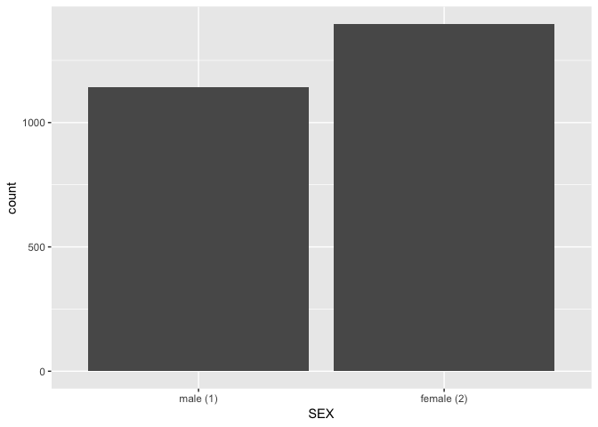

Lab 08 Replication
================
Christopher Prener, Ph.D.
(October 22, 2018)

## Introduction

This notebook replicates the Lab 08 assignment on working with factors.

## Dependencies

This notebook requires both `dplyr` and `forcats` for factor management.
It also requires a number of other packages for creating output
(`janitor`), writing data (`readr`), and plotting data (`ggplot2`).

``` r
# tidyverse packages
library(dplyr)        # data wrangling
```

    ## 
    ## Attaching package: 'dplyr'

    ## The following objects are masked from 'package:stats':
    ## 
    ##     filter, lag

    ## The following objects are masked from 'package:base':
    ## 
    ##     intersect, setdiff, setequal, union

``` r
library(forcats)      # factor wrangling
library(ggplot2)      # plotting data
library(readr)        # writing csv files

# other packages
library(here)         # file path management
```

    ## here() starts at /Users/chris/GitHub/SOC5050/LectureRepos/lecture-09/assignments/lab-08-replication

``` r
library(janitor)      # frequency tables
library(testDriveR)   # data
```

## Load Data

This notebook requires two sets of data: the `auto17` data and the
`gss14_simple` data - both from `testDriver`:

``` r
auto <- auto17
gss <- gss14_simple
```

## Part 1

First, we’ll work with the `auto17` data to make some changes to the
`class` variable.

### Question 1

We want to edit the contents of `driveStr` to make it more descriptive,
albeit in a different way than `driveStr2` is descriptive. The
categories are:

  - `TWD, Rear` when `driveStr` is `R`
  - `AWD` when `driveStr` is `A`
  - `TWD, Front` when `driveStr` is `F`
  - `FWD` when `driveStr` is `4`
  - `FWD, Part-time` when `driveStr` is `P`

We’ll use `case_when()` to accomplish this.

``` r
auto <- mutate(auto, driveStr3 = case_when(
  driveStr == "R" ~ "TWD, Rear",
  driveStr == "A" ~ "AWD",
  driveStr == "F" ~ "TWD, Front",
  driveStr == "4" ~ "FWD",
  driveStr == "P" ~ "FWD, Part-time"))

auto %>%
  tabyl(driveStr3) %>%
  adorn_pct_formatting(digits = 3)
```

    ##       driveStr3   n percent
    ##             AWD 328 26.974%
    ##             FWD 134 11.020%
    ##  FWD, Part-time  34  2.796%
    ##      TWD, Front 380 31.250%
    ##       TWD, Rear 340 27.961%

We now have a recoded string variable to work with.

### Question 2

One downside to string variables is that the values are displayed
alphabetically, rather than in a prescribed order. We can change that
with `fct_relevel()`:

``` r
auto <- mutate(auto, driveFct3 = fct_relevel(as.factor(driveStr3),
                                             "TWD, Front", "TWD, Rear", "AWD", "FWD, Part-time", "FWD"))

auto %>%
  tabyl(driveFct3) %>%
  adorn_pct_formatting(digits = 3)
```

    ##       driveFct3   n percent
    ##      TWD, Front 380 31.250%
    ##       TWD, Rear 340 27.961%
    ##             AWD 328 26.974%
    ##  FWD, Part-time  34  2.796%
    ##             FWD 134 11.020%

We now see our data presented in a more linear fashion. It is easy to
see that four wheel drive vehicles are relatively rare in the American
auto market - only 11% of vehicles available in model year 2017 had this
feature. The vast majority had either front or real variants of two
wheel drive.

### Question 3

We now want to export our frequency table. We can actually pipe the
results directly into `write_csv()` by omitting the object name from our
`write_csv()` call:

``` r
auto %>%
  tabyl(driveFct3) %>%
  adorn_pct_formatting(digits = 3) %>%
  write_csv(here("results", "auto_driveFct3_freq.csv"))
```

The frequency table’s contents is now saved in plain text for later
reference.

We also want to save our data for later as well. We can do this with the
same `write_csv()` function:

``` r
write_csv(auto, here("data", "analysis_auto.csv"))
```

Now the analytic sample has been saved to our `data/` folder.

## Part 2

Next, we’ll work with the `gss14_simple` data to make some changes to a
number of variables.

### Question 4

First, we want to explicitly declare `-1` values in the variable `HRS1`
as missing. Since there is only one missing value indicator, we can use
`ifelse()` to accomplish this:

``` r
gss <- mutate(gss, HRS1 = ifelse(HRS1 == -1, NA, HRS1))
```

Now we have a version of `HRS1` that will return the appropriate summary
statistics from functions.

### Question 5

We also want to recode `SEX` so that it is *both* a factor variable
named `SEX` and a logical variable named `FEMALE`:

``` r
gss %>%
  mutate(SEX = fct_recode(as.factor(SEX), 
                          "male (1)" = "1",
                          "female (2)" = "2"
                          )) %>%
  mutate(FEMALE = ifelse(SEX == "female (2)", TRUE, FALSE)) -> gss
```

The logical variable is better for statistical analyses, but the factor
version makes for clearer frequency tables. We can print a frequency
table for `SEX`:

``` r
gss %>%
  tabyl(SEX) %>%
  adorn_pct_formatting(digits = 3)
```

    ##         SEX    n percent
    ##    male (1) 1141 44.957%
    ##  female (2) 1397 55.043%

We can also print a frequency table for `FEMALE`:

``` r
gss %>%
  tabyl(FEMALE) %>%
  adorn_pct_formatting(digits = 3)
```

    ##  FEMALE    n percent
    ##   FALSE 1141 44.957%
    ##    TRUE 1397 55.043%

Both frequency tables have the same fundamental data, but it is
presented in two different ways. In both cases, we see that there are
1397 individuals in the sample who are female, making up just over 55%
of the respondents.

### Question 7

Using our factor variable, we now need to make a bar chart using
`ggplot2`:

``` r
ggplot(data = gss, mapping = aes(SEX)) +
  geom_bar()
```

<!-- -->

The bar chart visualizes the gender difference in the sample, where
where are more women than men as respondents. Notice how the values of
`SEX` have been transformed into labels on the plot. While the “(1)” and
“(2)” may be helpful analytically, they become distracting here. We’ll
discuss how to modify these properties of plots in coming weeks.

Finally, we’ll save the plot:

``` r
ggsave(here("results", "gss_sex.png"), dpi = 300)
```

    ## Saving 7 x 5 in image

Now the plot image is included in our project folder system.

### Question 8

Finally, we want to modify the `MARITAL` variable so that it has
descriptive value labels and missing data (value `9` - `No answer`) has
been properly managed. The final categories are:

  - `Married (1)` when `MARITAL` is `1`
  - `Widowed (2)` when `MARITAL` is `2`
  - `Divorced (3)` when `MARITAL` is `3`
  - `Separated (4)` when `MARITAL` is `4`
  - `Never married (5)` when `MARITAL` is `5`

<!-- end list -->

``` r
gss %>%
  mutate(MARITAL = ifelse(MARITAL == 9, NA, MARITAL)) %>%
  mutate(MARITAL = fct_recode(as.factor(MARITAL),
                              "Married (1)" = "1",
                              "Widowed (2)" = "2",
                              "Divorced (3)" = "3",
                              "Separated (4)" = "4",
                              "Never married (5)" = "5")) -> gss

gss %>%
  tabyl(MARITAL) %>%
  adorn_pct_formatting(digits = 3)
```

    ##            MARITAL    n percent valid_percent
    ##        Married (1) 1158 45.626%       45.699%
    ##        Widowed (2)  209  8.235%        8.248%
    ##       Divorced (3)  411 16.194%       16.219%
    ##      Separated (4)   81  3.191%        3.197%
    ##  Never married (5)  675 26.596%       26.638%
    ##               <NA>    4  0.158%             -

This gives us a nicely formatted way to visualize how marital status
varies in our data.

### Question 9

The final question asks to save both frequency tables as `.csv` files.
We can do this with the `write_csv()` function:

``` r
gss %>%
  tabyl(SEX) %>%
  adorn_pct_formatting(digits = 3) %>%
  write_csv(here("results", "gss_SEX_freq.csv"))

gss %>%
  tabyl(MARITAL) %>%
  adorn_pct_formatting(digits = 3) %>%
  write_csv(here("results", "gss_MARITAL_freq.csv"))
```

We also want to save our data for later as well. As before, we can do
this with the same `write_csv()` function:

``` r
write_csv(gss, here("data", "analysis_gss14.csv"))
```

We now have our final analytic sample saved in `data/` along with the
`auto` data we saved there earlier.
